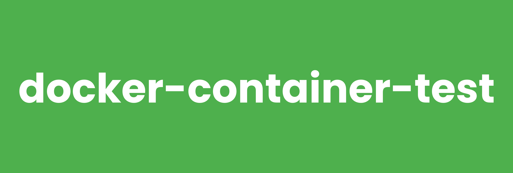

# docker-container-test



[](https://github.com/RagedUnicorn/docker-container-test/actions/workflows/docker_release.yml)


> Docker Alpine image with Google Container Structure Test for validating container images.


## Overview

This Docker image provides a lightweight Container Structure Test installation on Alpine Linux. It enables automated validation of Docker images by testing their structure, contents, and behavior without needing to run them.

## Features

- **Small footprint**: Minimal Alpine Linux base image
- **Container Structure Test v1.19.3**: Latest stable version
- **Docker-in-Docker support**: Can test images using the Docker socket
- **Multi-platform**: Supports linux/amd64 and linux/arm64
- **Ready-to-use**: Pre-configured for immediate testing

## Building the Image

```bash
docker build -t ragedunicorn/container-test .
```

## Usage

The container uses Container Structure Test as the entrypoint, allowing you to validate Docker images by testing their structure, contents, and behavior.

### Quick Start

```bash
# Test an image with a single test file
docker run -v /var/run/docker.sock:/var/run/docker.sock -v $(pwd)/test:/test \
  ragedunicorn/container-test:latest --image nginx:latest --config /test/nginx_test.yml

# Run all tests using Docker Compose
docker compose -f docker-compose.test.yml run test-all
```

For comprehensive testing documentation including examples, troubleshooting, and CI/CD integration, see [TEST.md](TEST.md).

## Development

For information about developing and contributing to this project, see [DEVELOPMENT.md](DEVELOPMENT.md).

## Versioning

This project uses semantic versioning that matches the Docker image contents:

**Format:** `{container-structure-test_version}-alpine{alpine_version}-{build_number}`

Examples:
- `1.19.3-alpine3.22.1-1` - Container Structure Test 1.19.3 on Alpine 3.22.1, build 1
- `latest` - Most recent stable release

For detailed release process and versioning guidelines, see [RELEASE.md](RELEASE.md).

## Automated Dependency Updates

This project uses [Renovate](https://docs.renovatebot.com/) to automatically check for updates to:
- Alpine Linux base image version (all major, minor, and patch updates)
- Container Structure Test version

Renovate runs weekly (every Monday) and creates pull requests when updates are available. The configuration tracks 
both Alpine Linux and Container Structure Test releases, creating separate pull requests for each update.

## Links

- [Container Structure Test Documentation](https://github.com/GoogleContainerTools/container-structure-test)
- [Alpine Linux](https://www.alpinelinux.org/)

## License

MIT License

Copyright (c) 2025 Michael Wiesendanger

Permission is hereby granted, free of charge, to any person obtaining
a copy of this software and associated documentation files (the
"Software"), to deal in the Software without restriction, including
without limitation the rights to use, copy, modify, merge, publish,
distribute, sublicense, and/or sell copies of the Software, and to
permit persons to whom the Software is furnished to do so, subject to
the following conditions:

The above copyright notice and this permission notice shall be
included in all copies or substantial portions of the Software.

THE SOFTWARE IS PROVIDED "AS IS", WITHOUT WARRANTY OF ANY KIND,
EXPRESS OR IMPLIED, INCLUDING BUT NOT LIMITED TO THE WARRANTIES OF
MERCHANTABILITY, FITNESS FOR A PARTICULAR PURPOSE AND
NONINFRINGEMENT. IN NO EVENT SHALL THE AUTHORS OR COPYRIGHT HOLDERS BE
LIABLE FOR ANY CLAIM, DAMAGES OR OTHER LIABILITY, WHETHER IN AN ACTION
OF CONTRACT, TORT OR OTHERWISE, ARISING FROM, OUT OF OR IN CONNECTION
WITH THE SOFTWARE OR THE USE OR OTHER DEALINGS IN THE SOFTWARE.