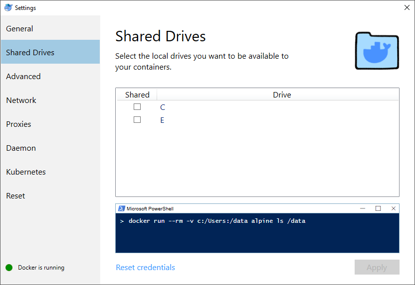
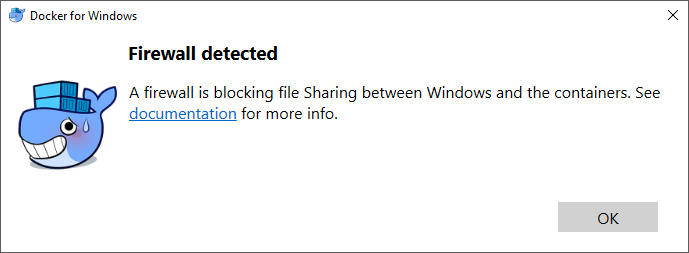
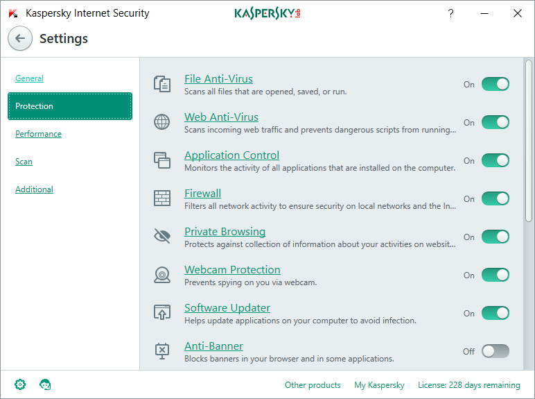
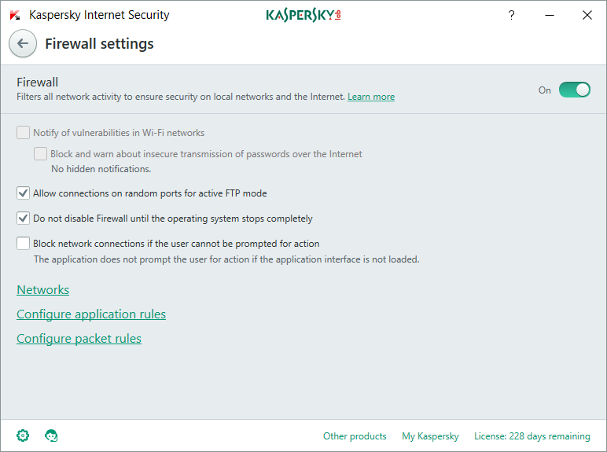
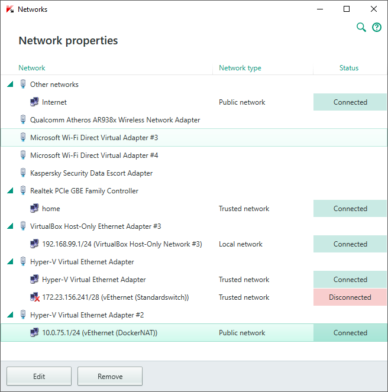
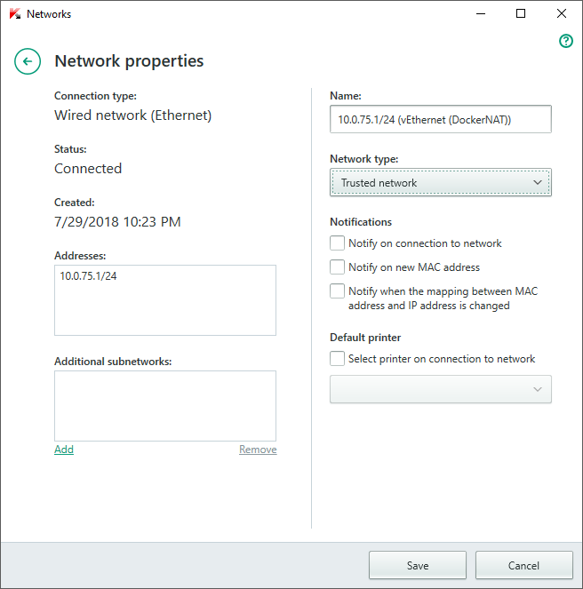

## Windows Sharing Volume

> Some hints to sharing volumes on Windows

The Docker ui on windows makes sharing a volume easy but there are some catches to this. Firewalls might block the sharing.

Docker detects and warns the user if a firewall blocks the volume sharing.

The documentation to fix this might be confusing. This documentation describes how this problem can be solved when using Kaspersky. For other similar software to Kaspersky the process should be similar.

In the Kaspersky settings choose `Protection` then click on `Firewall`

In the firewall settings choose `Networks` to see the list of available networks.

From here it might be a bit tricky to figure which one is the correct adapter that needs to be changes. It should however usually be possible to find it by locking for `DockerNAT` in the name.

Change the `Network type` to `Trusted network`. This will prevent Kaspersky from blocking the communication necessary to share volumes.

